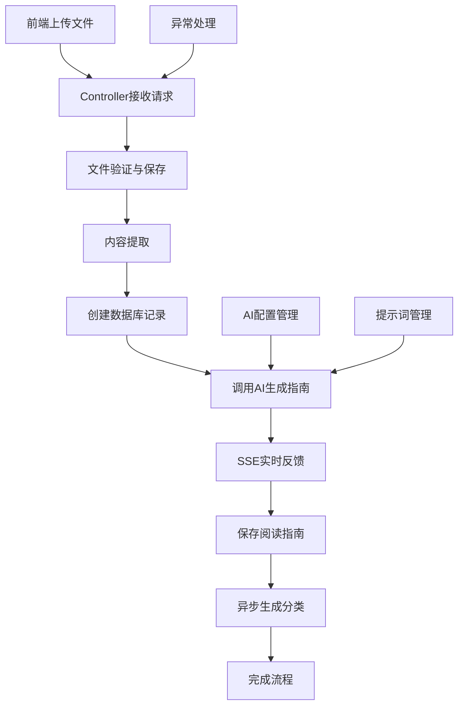

# AI文档阅读指南生成接口 - 完整开发指南

## 📋 概述

`generateReadingGuide` 接口是一个基于AI的文档智能分析服务，能够自动上传文档文件，提取内容，生成结构化阅读指南，并提供实时的处理进度反馈。

## 🔧 技术栈

- **后端框架**: Spring Boot 3.5.5 + Java 21
- **AI服务**: Kimi AI (Moonshot API)
- **文档处理**: Apache POI (Word) + PDFBox (PDF) + CommonMark (Markdown)
- **实时通信**: Server-Sent Events (SSE)
- **数据库**: H2嵌入式数据库 + MyBatis-Plus

## 🌐 接口定义

### 基本信息
- **URL**: `/literature/generate-guide`
- **Method**: `POST`
- **Content-Type**: `multipart/form-data`
- **Response**: `text/event-stream` (SSE)

### 请求参数

| 参数名 | 类型 | 必填 | 说明 |
|--------|------|------|------|
| file | MultipartFile | 是 | 文档文件，支持PDF、Word、Markdown |
| apiKey | String | 是 | Kimi AI的API密钥，格式必须以"sk-"开头 |

### 响应格式 (SSE事件流)

```typescript
// 开始处理事件
{
  name: "start",
  data: "开始处理文献文件..."
}

// 进度事件
{
  name: "progress",
  data: "文件保存成功，开始解析内容..."
}

// AI生成内容事件（流式返回）
{
  name: "content",
  data: "# 文献阅读指南\n\n## 核心摘要..."
}

// 完成事件
{
  name: "complete",
  data: "生成完成"
}

// 错误事件
{
  name: "error",
  data: "处理失败: API Key无效"
}
```

## 🏗️ 架构设计

### 核心组件



### 数据流程
1. **文件接收** → **验证** → **保存到磁盘**
2. **内容提取** → **创建记录** → **AI分析**
3. **实时反馈** → **保存结果** → **后台分类**

## ⚙️ 配置管理

### application.yml 配置

```yaml
# 文件处理配置
literature:
  file:
    upload-path: ./uploads/documents           # 文件存储路径
    max-file-size: 10MB                       # 单文件最大大小
    allowed-extensions: pdf,doc,docx,md,markdown # 允许的文件类型

# AI服务配置
  ai:
    base-url: https://api.moonshot.cn/v1      # Kimi AI API 地址
    model: kimi-k2-turbo-preview              # 使用的模型
    max-tokens: 20480                         # 最大 token 数
    temperature: 0.7                          # 生成随机性 (0.0-1.0)
    timeout: 60000                            # 请求超时时间（毫秒）

    # 系统提示词文件路径
    system-prompt-file: classpath:prompts/literature-guide-system-prompt.txt
    classification-prompt-file: classpath:prompts/literature-classification-system-prompt.txt

# Spring Boot 配置
spring:
  # 文件上传配置
  servlet:
    multipart:
      max-file-size: 10MB
      max-request-size: 100MB

  # 数据库配置 (H2)
  datasource:
    url: jdbc:h2:file:./data/literature_assistant
    driver-class-name: org.h2.Driver
    hikari:
      maximum-pool-size: 20
      minimum-idle: 5

  # 数据库初始化
  sql:
    init:
      schema-locations: classpath:db.sql
      mode: always
```

## 🤖 AI调用最佳实践

### 1. HTTP客户端配置

```java
// 推荐的OkHttp配置
private final OkHttpClient httpClient = new OkHttpClient.Builder()
    .connectTimeout(30, TimeUnit.SECONDS)           // 连接超时
    .readTimeout(5, TimeUnit.MINUTES)              // 读取超时（AI响应可能较慢）
    .writeTimeout(30, TimeUnit.SECONDS)             // 写入超时
    .addInterceptor(chain -> {
        Request original = chain.request();
        return chain.proceed(original.newBuilder()
            .header("Accept-Charset", "UTF-8")      // 确保UTF-8编码
            .build());
    })
    .build();
```

### 2. 请求参数优化

| 参数 | 阅读指南生成 | 分类生成 | 说明 |
|------|-------------|---------|------|
| `max_tokens` | 20480 | 500 | 阅读指南需要更多tokens |
| `temperature` | 0.7 | 0.3 | 指南要创造性，分类要准确 |
| `stream` | true | false | 指南要实时反馈，分类要完整响应 |
| `response_format` | - | json_object | 分类强制JSON格式 |

### 3. 错误处理策略

```java
// 多层异常处理
try {
    // AI调用
    String response = callAI();

    if (response == null || response.trim().isEmpty()) {
        throw new BusinessException("AI返回内容为空");
    }

    return response;

} catch (IOException e) {
    // 网络错误
    throw new BusinessException("网络请求失败: " + e.getMessage());

} catch (BusinessException e) {
    // 业务错误，直接抛出
    throw e;

} catch (Exception e) {
    // 其他未知错误
    throw new BusinessException("AI处理失败: " + e.getMessage());
}
```

## 📝 提示词设计指南

### 1. 系统提示词设计原则

#### 角色设定原则
```
# Role: 资深学术导师

## Profile:
- **身份**: 明确的专业身份和经验
- **核心技能**: 具体的专业能力和技术特长
- **沟通风格**: 亲切、耐心、专业且富有逻辑性
```

#### 工作流程设计
```
## Workflow:
请严格按照以下步骤，为我分析上传的文献：

1. **通读全文，宏观把握**: 整体理解
2. **生成「核心摘要」**: 提炼关键信息
3. **解析「关键术语」**: 解释核心概念
4. **创建「分步阅读地图」**: 结构化分解
5. **绘制「文献结构总览图」**: 全局视角
6. **提出「启发性思考」**: 深度引导
```

### 2. 强制输出格式要求

#### Mermaid图表生成规则
```text
## 图表生成规则:
- **语法**: 所有图表必须使用 Mermaid 语法生成，并用 ```mermaid ... ``` 代码块包裹
- **灵活性**: 根据内容选择最合适的图表类型：
    - 层级关系 → 思维导图 (mindmap)
    - 流程步骤 → 流程图 (graph TD/LR)
    - 组件关系 → 框图 (graph)
    - 时序交互 → 序列图 (sequenceDiagram)
- **位置**: 图表可以出现在指南的任何需要可视化说明的地方
```

#### 特殊字符处理规则
```text
### Mermaid 语法处理
为了确保图表能成功渲染，请严格遵循以下规则：

* **通用原则：包裹节点文本**
* 当节点文本包含任何特殊字符时，**必须用双引号 `"` 包裹**

* **示例**：
    * **错误**: `A --> B[结论：F = ma]`
    * **正确**: `A --> B["结论：F = ma"]`

* **处理换行符**: 在节点文本中使用 `<br>` 标签
* **严格遵守**: 确保图表的起始和结束标记正确
```

### 3. 分类提示词设计

```text
你是一位专业的文献分类专家，擅长从学术文献的阅读指南中提取关键信息并进行精准分类。

请根据提供的文献阅读指南，生成该文献的分类标签和简要描述。

## 输出要求：
1. **格式**：必须返回纯净的 JSON 格式，不包含任何其他文字说明
2. **标签**：最多 5 个分类标签，应该涵盖文献的主要研究领域、方法、应用等方面
3. **描述**：200 字以内的简洁描述，概括文献的核心内容和价值

## 输出格式示例：
```json
{
  "tags": ["机器学习", "深度学习", "计算机视觉", "图像识别", "神经网络"],
  "desc": "本文提出了一种基于深度卷积神经网络的图像识别方法，通过改进的网络架构和训练策略，在多个基准数据集上取得了显著的性能提升。"
}
```

## 分类原则：
- 标签应具体且有实际意义，避免过于宽泛的词汇
- 优先选择学科领域、研究方法、技术手段、应用场景等维度的标签
- 描述应突出文献的创新点、主要贡献和应用价值
- 使用中文标签和描述
```

## 💡 提示词优化技巧

### 1. 结构化输出
- 使用明确的标题层级 (`#`, `##`, `###`)
- 强制要求表格和图表
- 指定具体的输出格式

### 2. 内容质量控制
- 设置明确的字数限制
- 要求具体的输出数量（如"3-5个关键术语"）
- 提供输出示例

### 3. 错误预防
- 详细说明特殊字符处理规则
- 明确禁止某些操作
- 提供备选方案

## 🛠️ 完整代码实现

### 1. 控制器层 (Controller)

```java
@RestController
@RequestMapping("/literature")
@Tag(name = "文献助手", description = "文献分析和阅读指南生成")
@RequiredArgsConstructor
public class LiteratureController {

    private final FileProcessingService fileProcessingService;
    private final LiteratureAiService literatureAiService;
    private final LiteratureService literatureService;

    @PostMapping(value = "/generate-guide", produces = MediaType.TEXT_EVENT_STREAM_VALUE)
    @Operation(summary = "生成文献阅读指南", description = "上传文献文件，AI 生成阅读指南（SSE 流式响应）")
    public SseEmitter generateReadingGuide(
            @Parameter(description = "文献文件（支持 PDF、Word、Markdown）", required = true)
            @RequestParam("file") MultipartFile file,
            @Parameter(description = "Kimi AI API Key", required = true)
            @RequestParam("apiKey") @NotBlank(message = "API Key 不能为空") String apiKey) {

        // 创建 SSE 发射器，设置超时时间为 10 分钟
        SseEmitter sseEmitter = new SseEmitter(TimeUnit.MINUTES.toMillis(10));

        try {
            // 1. 验证 API Key
            literatureAiService.validateApiKey(apiKey);

            // 2. 发送开始事件
            sseEmitter.send(SseEmitter.event()
                    .name("start")
                    .data("开始处理文献文件..."));

            // 3. 保存文件
            String filePath = fileProcessingService.saveFile(file);
            sseEmitter.send(SseEmitter.event()
                    .name("progress")
                    .data("文件保存成功，开始解析内容..."));

            // 4. 解析文件内容
            String fileContent = fileProcessingService.extractFileContent(filePath);

            // 5. 创建文献记录
            Long literatureId = literatureService.createLiterature(file, filePath, fileContent.length());

            // 6. 创建内容收集器
            StringBuilder readingGuideBuilder = new StringBuilder();

            // 7. 异步生成阅读指南（带内容收集）
            literatureAiService.generateReadingGuideStream(apiKey, fileContent, sseEmitter, readingGuideBuilder);

            // 8. 设置完成回调
            final Long finalLiteratureId = literatureId;
            sseEmitter.onCompletion(() -> {
                // 保存阅读指南到数据库
                String readingGuide = readingGuideBuilder.toString();
                if (StrUtil.isNotBlank(readingGuide)) {
                    literatureService.updateReadingGuide(finalLiteratureId, readingGuide);

                    // 异步生成分类
                    literatureAiService.generateClassificationWithVirtualThread(
                            apiKey, readingGuide, finalLiteratureId, literatureService);
                } else {
                    literatureService.updateStatus(finalLiteratureId, Literature.Status.COMPLETED.getCode());
                }
            });

            // 9. 设置错误回调
            sseEmitter.onError((throwable) -> {
                if (finalLiteratureId != null) {
                    literatureService.updateStatus(finalLiteratureId, Literature.Status.FAILED.getCode());
                }
            });

            sseEmitter.onTimeout(() -> {
                if (finalLiteratureId != null) {
                    literatureService.updateStatus(finalLiteratureId, Literature.Status.FAILED.getCode());
                }
            });

        } catch (Exception e) {
            try {
                sseEmitter.send(SseEmitter.event()
                        .name("error")
                        .data("处理失败: " + e.getMessage()));
                sseEmitter.completeWithError(e);
            } catch (IOException ioException) {
                sseEmitter.completeWithError(ioException);
            }
        }

        return sseEmitter;
    }
}
```

### 2. AI服务层 (Service)

```java
@Service
public class LiteratureAiService {

    @Value("${literature.ai.base-url:https://api.moonshot.cn/v1}")
    private String baseUrl;

    @Value("${literature.ai.model:kimi-k2-turbo-preview}")
    private String model;

    @Value("${literature.ai.max-tokens:20480}")
    private Integer maxTokens;

    @Value("${literature.ai.temperature:0.7}")
    private Double temperature;

    @Value("${literature.ai.timeout:60000}")
    private Integer timeout;

    @Value("${literature.ai.system-prompt-file}")
    private String systemPromptFile;

    private final OkHttpClient httpClient;
    private final ResourceLoader resourceLoader;

    // 缓存系统提示词
    private String cachedSystemPrompt;

    public LiteratureAiService(ResourceLoader resourceLoader) {
        this.resourceLoader = resourceLoader;
        this.httpClient = new OkHttpClient.Builder()
                .connectTimeout(30, TimeUnit.SECONDS)
                .readTimeout(5, TimeUnit.MINUTES)
                .writeTimeout(30, TimeUnit.SECONDS)
                .addInterceptor(chain -> {
                    Request original = chain.request();
                    return chain.proceed(original.newBuilder()
                            .header("Accept-Charset", "UTF-8")
                            .build());
                })
                .build();
    }

    /**
     * 生成文献阅读指南（SSE 流式响应）
     */
    public void generateReadingGuideStream(String apiKey, String fileContent,
                                       SseEmitter sseEmitter, StringBuilder contentCollector) {
        CompletableFuture.runAsync(() -> {
            try {
                // 构建请求
                KimiChatRequest chatRequest = buildChatRequest(fileContent);
                String requestBody = JSONUtil.toJsonStr(chatRequest);

                // 创建 HTTP 请求
                Request request = new Request.Builder()
                        .url(baseUrl + "/chat/completions")
                        .header("Authorization", "Bearer " + apiKey)
                        .header("Content-Type", "application/json; charset=utf-8")
                        .header("Accept", "text/event-stream")
                        .header("Accept-Charset", "UTF-8")
                        .header("Cache-Control", "no-cache")
                        .post(RequestBody.create(requestBody, MediaType.parse("application/json; charset=utf-8")))
                        .build();

                // 创建 EventSource 监听器
                EventSourceListener listener = new EventSourceListener() {
                    @Override
                    public void onOpen(EventSource eventSource, Response response) {
                        log.info("AI SSE 连接已建立");
                    }

                    @Override
                    public void onEvent(EventSource eventSource, String id, String type, String data) {
                        try {
                            // 检查是否为结束标记
                            if ("[DONE]".equals(data)) {
                                sseEmitter.send(SseEmitter.event()
                                        .name("complete")
                                        .data("生成完成"));
                                sseEmitter.complete();
                                return;
                            }

                            // 解析 JSON 响应
                            JSONObject jsonData = JSONUtil.parseObj(data);
                            String content = extractContentFromResponse(jsonData);

                            if (content != null) {
                                // 收集内容
                                if (contentCollector != null) {
                                    contentCollector.append(content);
                                }

                                // 实时发送到前端
                                sseEmitter.send(SseEmitter.event()
                                        .name("content")
                                        .data(content));
                            }

                        } catch (Exception e) {
                            log.warn("处理 SSE 事件失败", e);
                        }
                    }

                    @Override
                    public void onClosed(EventSource eventSource) {
                        log.info("AI SSE 连接已关闭");
                    }

                    @Override
                    public void onFailure(EventSource eventSource, Throwable t, Response response) {
                        log.error("AI SSE 连接失败", t);
                        try {
                            String errorMsg = "AI 服务连接失败";
                            if (response != null) {
                                errorMsg += ": " + response.code() + " - " + response.message();
                            }

                            sseEmitter.send(SseEmitter.event()
                                    .name("error")
                                    .data(errorMsg));
                            sseEmitter.completeWithError(new BusinessException(errorMsg));
                        } catch (IOException e) {
                            sseEmitter.completeWithError(t);
                        }
                    }
                };

                // 创建 EventSource 并开始监听
                EventSource eventSource = EventSources.createFactory(httpClient)
                        .newEventSource(request, listener);

                // 设置回调
                sseEmitter.onCompletion(() -> eventSource.cancel());
                sseEmitter.onError(throwable -> eventSource.cancel());
                sseEmitter.onTimeout(() -> eventSource.cancel());

            } catch (Exception e) {
                log.error("生成文献阅读指南失败", e);
                try {
                    sseEmitter.send(SseEmitter.event()
                            .name("error")
                            .data("生成文献阅读指南失败: " + e.getMessage()));
                    sseEmitter.completeWithError(e);
                } catch (IOException ioException) {
                    sseEmitter.completeWithError(ioException);
                }
            }
        });
    }

    /**
     * 构建聊天请求
     */
    private KimiChatRequest buildChatRequest(String fileContent) {
        KimiChatRequest request = new KimiChatRequest();
        request.setModel(model);
        request.setMaxTokens(maxTokens);
        request.setTemperature(temperature);
        request.setStream(true);

        // 构建消息
        request.setMessages(Arrays.asList(
                new KimiChatRequest.Message("system", getSystemPrompt()),
                new KimiChatRequest.Message("user", "请为以下文献生成阅读指南：\n\n" + fileContent)
        ));

        return request;
    }

    /**
     * 获取系统提示词（带缓存）
     */
    private String getSystemPrompt() {
        if (cachedSystemPrompt == null) {
            cachedSystemPrompt = loadPromptFromFile(systemPromptFile);
        }
        return cachedSystemPrompt;
    }

    /**
     * 从资源文件加载提示词内容
     */
    private String loadPromptFromFile(String filePath) {
        String resourcePath = filePath.replace("classpath:", "");

        try (InputStream inputStream = this.getClass().getClassLoader().getResourceAsStream(resourcePath);
             InputStreamReader reader = new InputStreamReader(inputStream, StandardCharsets.UTF_8);
             BufferedReader bufferedReader = new BufferedReader(reader)) {

            StringBuilder contentBuilder = new StringBuilder();
            String line;
            while ((line = bufferedReader.readLine()) != null) {
                contentBuilder.append(line).append(System.lineSeparator());
            }

            return contentBuilder.toString();

        } catch (IOException e) {
            throw new BusinessException("读取系统提示词文件失败: " + e.getMessage());
        }
    }

    /**
     * 从响应中提取内容
     */
    private String extractContentFromResponse(JSONObject jsonData) {
        try {
            JSONObject delta = jsonData.getJSONArray("choices")
                    .getJSONObject(0)
                    .getJSONObject("delta");

            if (delta.containsKey("content")) {
                return delta.getStr("content");
            }

            return null;
        } catch (Exception e) {
            return null;
        }
    }

    /**
     * 验证 API Key
     */
    public void validateApiKey(String apiKey) {
        if (StrUtil.isBlank(apiKey)) {
            throw new BusinessException("API Key 不能为空");
        }

        if (!apiKey.startsWith("sk-")) {
            throw new BusinessException("API Key 格式错误");
        }
    }
}
```

### 3. 请求DTO

```java
@Data
public class KimiChatRequest {
    private String model;
    private List<Message> messages;

    @Alias("max_tokens")
    private Integer maxTokens;

    private Double temperature;
    private Boolean stream;

    @Data
    public static class Message {
        private String role;
        private String content;

        public Message(String role, String content) {
            this.role = role;
            this.content = content;
        }
    }
}
```

### 4. 数据库配置

#### db.sql (数据库初始化脚本)
```sql
-- 文献表
CREATE TABLE IF NOT EXISTS literature (
    id             BIGINT AUTO_INCREMENT PRIMARY KEY,
    original_name  VARCHAR(255) NOT NULL,
    file_path      VARCHAR(500) NOT NULL,
    file_size      BIGINT       NOT NULL,
    file_type      VARCHAR(10)  NOT NULL,
    content_length INT       DEFAULT 0,
    tags           VARCHAR(2000),
    description    VARCHAR(2000),
    reading_guide  CLOB,
    status         TINYINT   DEFAULT 1,
    create_time    TIMESTAMP DEFAULT CURRENT_TIMESTAMP,
    update_time    TIMESTAMP DEFAULT CURRENT_TIMESTAMP,
    deleted        TINYINT   DEFAULT 0
);
```

### 5. 前端调用示例

#### JavaScript (使用fetch API)
```javascript
async function generateReadingGuide(file, apiKey) {
    const formData = new FormData();
    formData.append('file', file);
    formData.append('apiKey', apiKey);

    try {
        const response = await fetch('/api/literature/generate-guide', {
            method: 'POST',
            body: formData
        });

        if (!response.ok) {
            throw new Error(`HTTP error! status: ${response.status}`);
        }

        const reader = response.body.getReader();
        const decoder = new TextDecoder();

        while (true) {
            const { done, value } = await reader.read();

            if (done) break;

            const chunk = decoder.decode(value);
            const lines = chunk.split('\n');

            for (const line of lines) {
                if (line.startsWith('data: ')) {
                    const data = line.substring(6);

                    // 解析 SSE 事件
                    if (data === '[DONE]') {
                        console.log('生成完成');
                        return;
                    }

                    try {
                        const event = JSON.parse(data);
                        handleSSEEvent(event);
                    } catch (e) {
                        console.log('接收到的内容:', data);
                    }
                }
            }
        }
    } catch (error) {
        console.error('生成阅读指南失败:', error);
    }
}

function handleSSEEvent(event) {
    switch (event.name) {
        case 'start':
            console.log('开始处理:', event.data);
            break;
        case 'progress':
            console.log('进度:', event.data);
            break;
        case 'content':
            console.log('内容:', event.data);
            // 实时显示生成的内容
            updateContentDisplay(event.data);
            break;
        case 'complete':
            console.log('生成完成:', event.data);
            break;
        case 'error':
            console.error('处理错误:', event.data);
            break;
    }
}

function updateContentDisplay(content) {
    // 更新前端显示内容的逻辑
    const contentDiv = document.getElementById('content-display');
    contentDiv.innerHTML += content;
}
```

## 📦 依赖配置

### Maven依赖 (pom.xml)
```xml
<dependencies>
    <!-- Spring Boot Web Starter -->
    <dependency>
        <groupId>org.springframework.boot</groupId>
        <artifactId>spring-boot-starter-web</artifactId>
    </dependency>

    <!-- Spring Boot Validation -->
    <dependency>
        <groupId>org.springframework.boot</groupId>
        <artifactId>spring-boot-starter-validation</artifactId>
    </dependency>

    <!-- Hutool 工具类 -->
    <dependency>
        <groupId>cn.hutool</groupId>
        <artifactId>hutool-all</artifactId>
        <version>5.8.29</version>
    </dependency>

    <!-- Knife4j 接口文档 -->
    <dependency>
        <groupId>com.github.xiaoymin</groupId>
        <artifactId>knife4j-openapi3-jakarta-spring-boot-starter</artifactId>
        <version>4.5.0</version>
    </dependency>

    <!-- 文档处理库 -->
    <dependency>
        <groupId>org.apache.poi</groupId>
        <artifactId>poi</artifactId>
        <version>5.2.5</version>
    </dependency>
    <dependency>
        <groupId>org.apache.poi</groupId>
        <artifactId>poi-ooxml</artifactId>
        <version>5.2.5</version>
    </dependency>
    <dependency>
        <groupId>org.apache.pdfbox</groupId>
        <artifactId>pdfbox</artifactId>
        <version>2.0.29</version>
    </dependency>
    <dependency>
        <groupId>org.commonmark</groupId>
        <artifactId>commonmark</artifactId>
        <version>0.21.0</version>
    </dependency>

    <!-- OkHttp for HTTP requests -->
    <dependency>
        <groupId>com.squareup.okhttp3</groupId>
        <artifactId>okhttp</artifactId>
        <version>4.12.0</version>
    </dependency>
    <dependency>
        <groupId>com.squareup.okhttp3</groupId>
        <artifactId>okhttp-sse</artifactId>
        <version>4.12.0</version>
    </dependency>

    <!-- 数据库相关 -->
    <dependency>
        <groupId>com.h2database</groupId>
        <artifactId>h2</artifactId>
        <scope>runtime</scope>
    </dependency>
    <dependency>
        <groupId>com.baomidou</groupId>
        <artifactId>mybatis-plus-spring-boot3-starter</artifactId>
        <version>3.5.5</version>
    </dependency>

    <!-- Lombok -->
    <dependency>
        <groupId>org.projectlombok</groupId>
        <artifactId>lombok</artifactId>
        <optional>true</optional>
    </dependency>
</dependencies>
```

## 🚀 部署和使用

### 1. 快速启动

```bash
# 方式一：使用启动脚本
./start.bat  # Windows
./start.sh    # Linux/macOS

# 方式二：手动启动
mvn clean package
java -jar target/literature-assistant-0.0.1-SNAPSHOT.jar

# 方式三：开发模式
mvn spring-boot:run
```

### 2. API测试

#### 使用curl测试
```bash
# 上传文件并生成阅读指南
curl -X POST \
  http://localhost:8086/api/literature/generate-guide \
  -F "file=@/path/to/your/document.pdf" \
  -F "apiKey=sk-your-api-key-here"
```

#### 使用Postman测试
1. 设置请求方法：POST
2. URL：`http://localhost:8086/api/literature/generate-guide`
3. Body类型：form-data
4. 添加字段：
   - `file` (File类型)：选择要上传的文档
   - `apiKey` (Text类型)：输入API密钥
5. 点击发送，观察响应流

### 3. 监控和调试

#### 查看API文档
访问：`http://localhost:8086/api/doc.html`

#### 查看健康状态
```bash
curl http://localhost:8086/api/literature/health
```

#### 查看日志
```bash
tail -f logs/literature-assistant.log
```

## ⚠️ 注意事项和最佳实践

### 1. 安全考虑
- **API Key安全**：不要在前端硬编码API Key，应该通过安全的方式传递
- **文件安全**：上传的文件应该进行病毒扫描
- **权限控制**：实施适当的用户认证和授权

### 2. 性能优化
- **文件大小限制**：根据服务器配置设置合理的文件大小限制
- **并发控制**：限制同时处理的文件数量，避免资源耗尽
- **缓存机制**：对重复的文件可以实施缓存策略

### 3. 错误处理
- **网络超时**：设置合理的超时时间，提供友好的错误提示
- **API限制**：处理AI服务的速率限制和配额限制
- **文件格式**：验证上传文件格式的有效性

### 4. 可扩展性
- **多AI服务支持**：可以抽象AI服务接口，支持多个AI提供商
- **插件化文档处理**：可以支持更多文档格式的插件化扩展
- **分布式部署**：考虑微服务架构，实现水平扩展

这份完整的开发指南涵盖了从接口定义、架构设计、AI调用、提示词设计到完整代码实现的所有关键环节，可以帮助你快速复现和开发类似的AI文档分析功能。