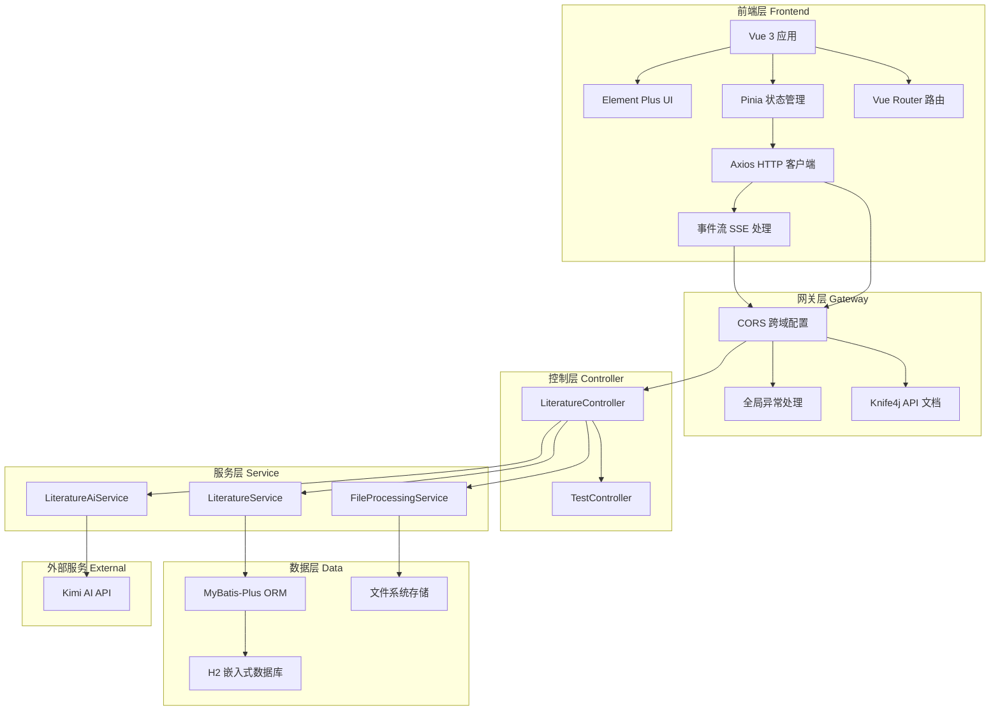
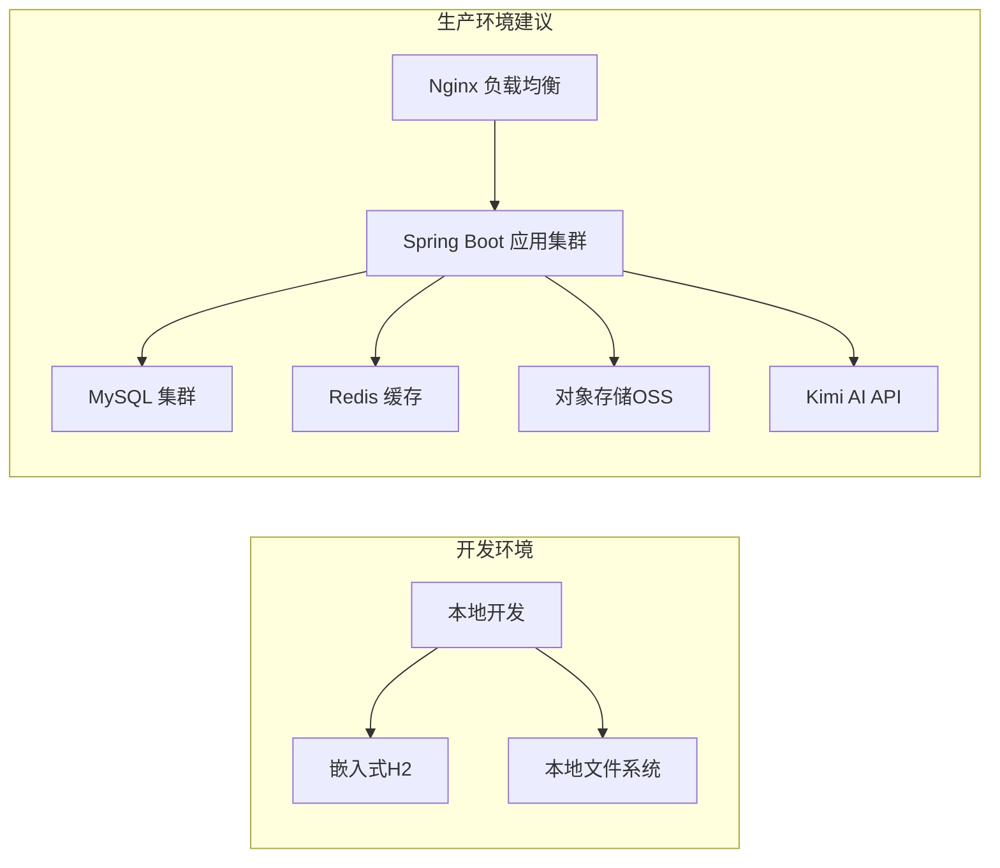
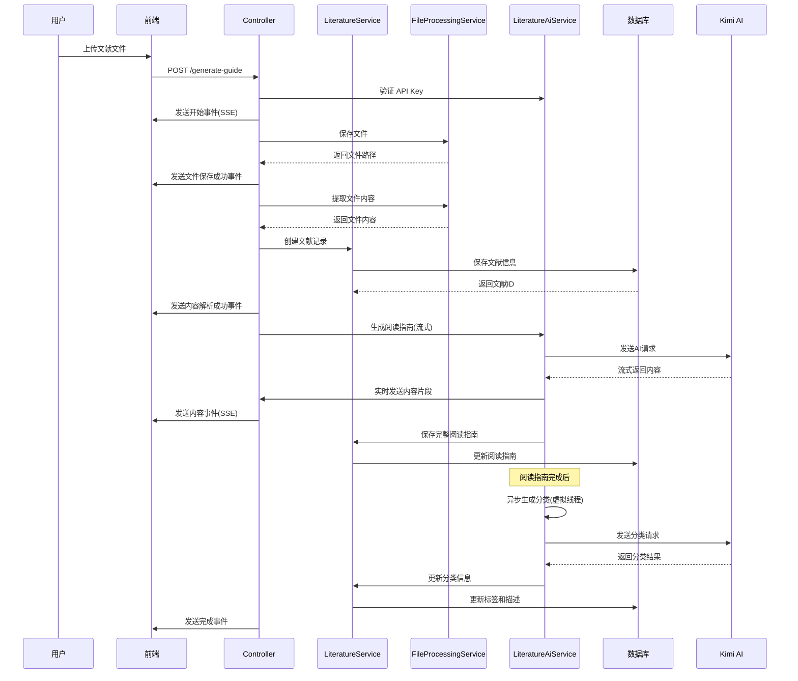
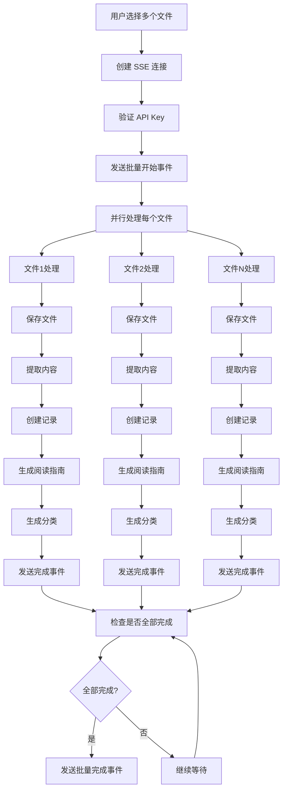
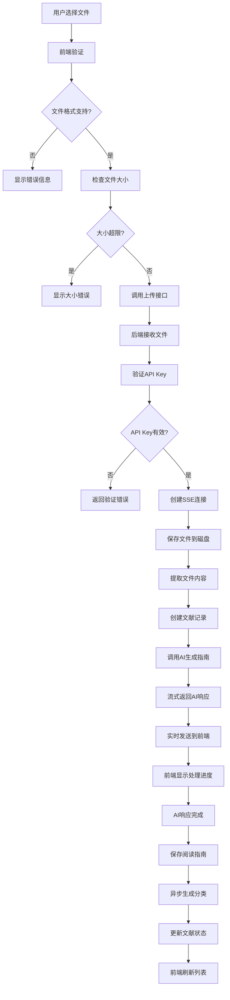
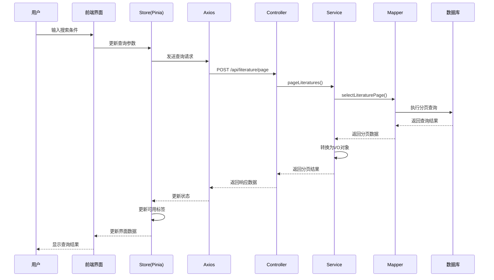
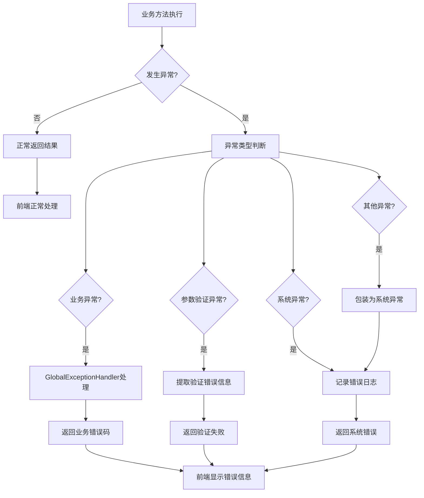

# 文献助手项目技术分析报告

## 项目概述

文献助手是一个基于 Spring Boot 3 + Vue 3 的现代化文献管理系统，集成了 AI 技术为用户提供智能文献阅读指南生成、文献管理和检索功能。该项目采用了前后端分离架构，后端提供 RESTful API，前端采用响应式设计，支持实时流式交互。

## 1. 技术栈选择

### 1.1 后端技术栈

#### 核心框架
- **Spring Boot 3.5.5**：作为基础框架，提供自动配置、依赖注入等企业级特性
- **Java 21**：采用最新的 LTS 版本，支持虚拟线程等新特性
- **Maven**：项目构建和依赖管理

#### 数据层技术
- **H2 Database**：嵌入式数据库，零配置开箱即用
- **MyBatis-Plus 3.5.5**：MyBatis 增强工具，简化 CRUD 操作
- **HikariCP**：Spring Boot 默认连接池，高性能

#### 文件处理技术
- **Apache POI 5.2.5**：处理 Word 文档（.doc/.docx）
- **PDFBox 2.0.29**：处理 PDF 文件内容提取
- **CommonMark 0.21.0**：解析 Markdown 文件
- **Apache Commons IO 2.15.1**：文件操作工具库

#### AI 集成技术
- **OkHttp 4.12.0**：HTTP 客户端，支持 SSE 流式请求
- **Hutool 5.8.29**：Java 工具类库，简化开发

#### API 文档技术
- **Knife4j 4.5.0**：Swagger 3 增强，提供交互式 API 文档

### 1.2 前端技术栈

#### 核心框架
- **Vue 3.4.21**：采用 Composition API
- **Vite 5.2.0**：现代化构建工具，快速开发体验
- **Vue Router 4.3.0**：单页应用路由管理

#### UI 框架
- **Element Plus 2.6.3**：Vue 3 组件库
- **@element-plus/icons-vue 2.3.1**：图标组件

#### 状态管理
- **Pinia 2.1.7**：Vue 3 推荐的状态管理库

#### 网络和工具
- **Axios 1.6.8**：HTTP 请求库
- **@microsoft/fetch-event-source 2.0.1**：SSE 流式数据处理
- **Marked 12.0.1**：Markdown 解析器
- **Mermaid 10.9.0**：图表生成库

### 1.3 技术选型评价

#### 优势
1. **技术栈现代化**：全面采用最新版本的技术
2. **前后端分离**：清晰的职责分离，便于团队协作
3. **流式交互**：采用 SSE 实现实时数据传输
4. **嵌入式数据库**：H2 数据库简化部署和维护
5. **虚拟线程**：利用 Java 21 新特性提升并发性能

#### 潜在改进点
1. **数据库选择**：生产环境可考虑 MySQL 或 PostgreSQL
2. **缓存机制**：可引入 Redis 提升性能
3. **消息队列**：大批量处理时可使用 RabbitMQ 或 Kafka

## 2. 架构设计

### 2.1 系统架构图



### 2.2 分层架构说明

#### 前端架构
- **视图层**：Vue 3 组件，实现用户界面
- **状态管理层**：Pinia 管理应用状态和数据流
- **路由层**：Vue Router 处理页面导航
- **网络层**：Axios 处理 HTTP 请求和 SSE 流

#### 后端架构
- **控制层**：REST API 接口，处理 HTTP 请求
- **服务层**：业务逻辑处理，AI 集成
- **数据访问层**：数据库操作和数据持久化
- **存储层**：文件系统存储和数据库存储

### 2.3 部署架构



## 3. 包结构设计

### 3.1 后端包结构

```
com.yuyuan.literature/
├── LiteratureAssistantApplication.java          # 应用启动类
├── common/                                    # 通用组件
│   ├── constant/                              # 常量定义
│   │   └── CommonConstants.java
│   ├── dto/                                   # 数据传输对象
│   │   ├── BaseDTO.java
│   │   ├── BatchLiteratureImportRequest.java
│   │   ├── ClassificationResponse.java
│   │   ├── KimiChatRequest.java
│   │   ├── KimiChatResponse.java
│   │   ├── LiteratureAnalysisRequest.java
│   │   ├── LiteratureQueryRequest.java
│   │   └── LiteratureVO.java
│   ├── entity/                                # 基础实体类
│   │   └── BaseEntity.java
│   ├── exception/                             # 异常处理
│   │   ├── BaseException.java
│   │   ├── BusinessException.java
│   │   └── ValidationException.java
│   ├── handler/                               # 全局处理器
│   │   └── GlobalExceptionHandler.java
│   ├── request/                               # 请求对象
│   │   ├── BaseRequest.java
│   │   └── PageRequest.java
│   ├── result/                                # 响应结果
│   │   ├── Result.java
│   │   └── ResultCode.java
│   └── utils/                                 # 工具类
│       └── ResponseUtils.java
├── config/                                    # 配置类
│   ├── CorsConfig.java                         # 跨域配置
│   ├── Knife4jConfig.java                      # API文档配置
│   └── MyBatisPlusConfig.java                 # MyBatis配置
├── controller/                                # 控制层
│   ├── LiteratureController.java                # 文献相关接口
│   └── TestController.java                    # 测试接口
├── dto/                                       # 数据传输对象（已移至common）
├── entity/                                    # 实体类
│   └── Literature.java                         # 文献实体
├── mapper/                                    # 数据访问层
│   └── LiteratureMapper.java                   # 文献数据访问
├── service/                                   # 服务层接口
│   ├── FileProcessingService.java               # 文件处理服务
│   ├── LiteratureAiService.java                # AI 服务
│   └── LiteratureService.java                  # 文献业务服务
└── service/impl/                              # 服务层实现
    └── LiteratureServiceImpl.java              # 文献服务实现
```

### 3.2 前端目录结构

```
literature-assistant-frontend/
├── public/
│   ├── index.html                             # HTML 模板
│   └── logo.png                              # 应用图标
├── src/
│   ├── components/                            # 公共组件
│   │   ├── BatchImportModal.vue              # 批量导入模态框
│   │   ├── ErrorBoundary.vue                 # 错误边界组件
│   │   └── ImportLiteratureModal.vue        # 导入文献模态框
│   ├── router/                               # 路由配置
│   │   └── index.js
│   ├── stores/                               # 状态管理
│   │   └── literatureStore.js               # 文献状态管理
│   ├── style.css                             # 全局样式
│   ├── views/                                # 页面组件
│   │   ├── LiteratureDetailView.vue           # 文献详情页
│   │   └── LiteratureListView.vue            # 文献列表页
│   ├── App.vue                              # 根组件
│   └── main.js                              # 应用入口
├── package.json                              # 依赖配置
└── vite.config.js                            # Vite 配置
```

### 3.3 包结构设计评价

#### 优势
1. **职责清晰**：按照功能模块划分，便于维护
2. **分层明确**：控制层、服务层、数据层分离
3. **通用性好**：common 包提供可复用组件
4. **符合规范**：遵循 Java 包命名约定

#### 改进建议
1. **dto 统一**：已将 dto 移至 common 包，保持一致性
2. **配置集中**：考虑添加 config 包统一管理配置
3. **枚举抽取**：可将状态码等常量抽取为枚举类

## 4. 设计模式应用

### 4.1 使用的设计模式

#### 4.1.1 依赖注入模式
```java
@Service
@RequiredArgsConstructor  // Lombok 注解，实现构造器注入
public class LiteratureServiceImpl implements LiteratureService {
    private final FileProcessingService fileProcessingService;
    private final LiteratureAiService literatureAiService;
    // 业务逻辑...
}
```

#### 4.1.2 模板方法模式
```java
// 文件处理模板方法
public String extractFileContent(String filePath) {
    String extension = FilenameUtils.getExtension(filePath).toLowerCase();
    return switch (extension) {
        case "pdf" -> extractPdfContent(file);
        case "doc" -> extractDocContent(file);
        case "docx" -> extractDocxContent(file);
        case "md", "markdown" -> extractMarkdownContent(file);
        default -> throw new BusinessException(ResultCode.FILE_TYPE_NOT_SUPPORTED);
    };
}
```

#### 4.1.3 策略模式
```java
// 不同文件类型的解析策略
private String extractPdfContent(File file) throws IOException {
    try (PDDocument document = PDDocument.load(file)) {
        PDFTextStripper stripper = new PDFTextStripper();
        return stripper.getText(document);
    }
}

private String extractDocxContent(File file) throws IOException {
    try (FileInputStream fis = new FileInputStream(file);
         XWPFDocument document = new XWPFDocument(fis)) {
        StringBuilder content = new StringBuilder();
        for (XWPFParagraph paragraph : document.getParagraphs()) {
            content.append(paragraph.getText()).append("\n");
        }
        return content.toString();
    }
}
```

#### 4.1.4 观察者模式（SSE）
```java
// SSE 事件监听
EventSourceListener listener = new EventSourceListener() {
    @Override
    public void onEvent(EventSource eventSource, String id, String type, String data) {
        try {
            // 处理事件并通知前端
            sseEmitter.send(SseEmitter.event().name("content").data(content));
        } catch (Exception e) {
            log.warn("处理SSE事件失败", e);
        }
    }
};
```

#### 4.1.5 工厂模式
```java
// 文件处理工厂（隐式）
public String saveFile(MultipartFile file) {
    // 统一的文件保存接口，内部处理不同类型
    validateFile(file);  // 验证策略
    Path filePath = generateUniquePath(file);  // 路径生成策略
    Files.copy(file.getInputStream(), filePath);  // 保存策略
    return filePath.toString();
}
```

#### 4.1.6 装饰器模式
```java
// HTTP 客户端配置装饰器
this.httpClient = new OkHttpClient.Builder()
    .connectTimeout(30, TimeUnit.SECONDS)
    .readTimeout(5, TimeUnit.MINUTES)
    .addInterceptor(chain -> {
        Request original = chain.request();
        Request.Builder requestBuilder = original.newBuilder()
                .header("Accept-Charset", "UTF-8");
        return chain.proceed(requestBuilder.build());
    })
    .build();
```

### 4.2 设计模式效果评价

#### 优势
1. **松耦合**：通过依赖注入降低组件间耦合度
2. **可扩展**：策略模式支持新文件类型的扩展
3. **一致性**：模板方法确保处理流程的一致性
4. **实时性**：观察者模式实现实时数据推送

#### 可补充的模式
1. **建造者模式**：可用于复杂请求对象构建
2. **适配器模式**：可用于不同 AI 服务的适配
3. **命令模式**：可用于操作历史记录和撤销

## 5. 接口设计

### 5.1 RESTful API 设计

#### 5.1.1 文献管理接口

```java
@RestController
@RequestMapping("/literature")
@Tag(name = "文献助手", description = "文献分析和阅读指南生成")
public class LiteratureController {

    /**
     * 生成文献阅读指南（单个文件）
     */
    @PostMapping(value = "/generate-guide", produces = MediaType.TEXT_EVENT_STREAM_VALUE)
    @Operation(summary = "生成文献阅读指南")
    public SseEmitter generateReadingGuide(
            @RequestParam("file") MultipartFile file,
            @RequestParam("apiKey") String apiKey) {
        // 实现逻辑...
    }

    /**
     * 批量导入文献
     */
    @PostMapping(value = "/batch-import", consumes = MediaType.MULTIPART_FORM_DATA_VALUE)
    @Operation(summary = "批量导入文献")
    public SseEmitter batchImportLiterature(
            @RequestPart("files") List<MultipartFile> files,
            @RequestParam("apiKey") String apiKey) {
        // 实现逻辑...
    }

    /**
     * 分页查询文献
     */
    @PostMapping("/page")
    @Operation(summary = "分页查询文献")
    public Result<PageResult<LiteratureVO>> pageLiteratures(
            @Valid @RequestBody LiteratureQueryRequest request) {
        // 实现逻辑...
    }

    /**
     * 获取文献详情
     */
    @GetMapping("/{id}")
    @Operation(summary = "获取文献详情")
    public Result<LiteratureVO> getLiteratureDetail(@PathVariable Long id) {
        // 实现逻辑...
    }

    /**
     * 下载文献文件
     */
    @GetMapping("/{id}/download")
    @Operation(summary = "下载文献文件")
    public void downloadLiteratureFile(@PathVariable Long id, HttpServletResponse response) {
        // 实现逻辑...
    }

    /**
     * 健康检查
     */
    @GetMapping("/health")
    @Operation(summary = "健康检查")
    public String health() {
        return "Literature Assistant is running!";
    }
}
```

### 5.2 接口设计特点

#### 5.2.1 RESTful 设计原则
1. **资源导向**：以文献（literature）为核心资源
2. **HTTP 方法语义**：GET 查询、POST 创建、PUT 更新、DELETE 删除
3. **状态码规范**：合理使用 HTTP 状态码
4. **统一响应格式**：Result<T> 包装响应数据

#### 5.2.2 SSE 流式接口
```java
// SSE 接口设计
@PostMapping(value = "/generate-guide", produces = MediaType.TEXT_EVENT_STREAM_VALUE)
public SseEmitter generateReadingGuide(...) {
    SseEmitter sseEmitter = new SseEmitter(TimeUnit.MINUTES.toMillis(10));

    // 发送不同类型的事件
    sseEmitter.send(SseEmitter.event().name("start").data("开始处理..."));
    sseEmitter.send(SseEmitter.event().name("progress").data("解析内容..."));
    sseEmitter.send(SseEmitter.event().name("content").data(content));
    sseEmitter.send(SseEmitter.event().name("complete").data("生成完成"));

    return sseEmitter;
}
```

### 5.3 请求响应对象设计

#### 5.3.1 统一响应格式
```java
@Data
public class Result<T> {
    private Integer code;
    private String message;
    private T data;
    private Long timestamp;

    public static <T> Result<T> success(T data) {
        return Result.<T>builder()
                .code(ResultCode.SUCCESS.getCode())
                .message(ResultCode.SUCCESS.getMessage())
                .data(data)
                .timestamp(System.currentTimeMillis())
                .build();
    }
}
```

#### 5.3.2 分页查询请求
```java
@Data
@EqualsAndHashCode(callSuper = true)
public class LiteratureQueryRequest extends PageRequest {
    @Schema(description = "关键词搜索")
    private String keyword;

    @Schema(description = "标签过滤")
    private List<String> tags;

    @Schema(description = "文件类型过滤")
    private String fileType;

    @Schema(description = "开始日期")
    private String startDate;

    @Schema(description = "结束日期")
    private String endDate;

    @Schema(description = "状态过滤")
    private Integer status;
}
```

### 5.4 接口设计评价

#### 优势
1. **RESTful 规范**：遵循 REST 设计原则
2. **实时交互**：SSE 支持流式数据传输
3. **文档完善**：Knife4j 提供交互式 API 文档
4. **异常处理**：全局异常处理器统一错误处理

#### 改进建议
1. **版本控制**：可添加 API 版本控制（如 /api/v1）
2. **安全认证**：可考虑 JWT 认证机制
3. **限流控制**：添加请求限流保护

## 6. 核心业务逻辑

### 6.1 文献处理流程

#### 6.1.1 单文件处理流程



#### 6.1.2 批量文件处理流程



### 6.2 AI 集成逻辑

#### 6.2.1 阅读指南生成
```java
public void generateReadingGuideStream(String apiKey, String fileContent,
                                   SseEmitter sseEmitter, StringBuilder contentCollector) {
    // 1. 构建AI请求
    KimiChatRequest chatRequest = buildChatRequest(fileContent);

    // 2. 创建SSE监听器
    EventSourceListener listener = new EventSourceListener() {
        @Override
        public void onEvent(EventSource eventSource, String id, String type, String data) {
            if ("[DONE]".equals(data)) {
                sseEmitter.complete();
                return;
            }

            JSONObject jsonData = JSONUtil.parseObj(data);
            String content = extractContentFromResponse(jsonData);

            if (content != null) {
                // 收集完整内容
                if (contentCollector != null) {
                    contentCollector.append(content);
                }
                // 实时发送到前端
                sseEmitter.send(SseEmitter.event().name("content").data(content));
            }
        }
    };

    // 3. 创建EventSource连接
    EventSource eventSource = EventSources.createFactory(httpClient)
            .newEventSource(request, listener);
}
```

#### 6.2.2 文献分类生成
```java
public void generateClassificationWithVirtualThread(String apiKey, String readingGuide,
                                              Long literatureId, LiteratureService literatureService) {
    // 使用虚拟线程进行异步处理
    Thread.startVirtualThread(() -> {
        try {
            // 1. 构建分类请求
            KimiChatRequest chatRequest = buildClassificationRequest(readingGuide);

            // 2. 发送请求获取分类结果
            String content = generateReadingGuide(apiKey, readingGuide);

            // 3. 解析分类结果
            ClassificationResponse classification = JSONUtil.toBean(content.trim(), ClassificationResponse.class);

            // 4. 更新数据库
            literatureService.updateClassification(literatureId, classification.getTags(), classification.getDesc());

        } catch (Exception e) {
            log.error("生成文献分类失败", e);
            literatureService.updateStatus(literatureId, Literature.Status.COMPLETED.getCode());
        }
    });
}
```

### 6.3 文件处理逻辑

#### 6.3.1 多格式文件解析
```java
public String extractFileContent(String filePath) {
    File file = new File(filePath);
    String extension = FilenameUtils.getExtension(filePath).toLowerCase();

    return switch (extension) {
        case "pdf" -> extractPdfContent(file);
        case "doc" -> extractDocContent(file);
        case "docx" -> extractDocxContent(file);
        case "md", "markdown" -> extractMarkdownContent(file);
        default -> throw new BusinessException(ResultCode.FILE_TYPE_NOT_SUPPORTED);
    };
}
```

#### 6.3.2 文件验证逻辑
```java
private void validateFile(MultipartFile file) {
    // 1. 文件非空检查
    if (file == null || file.isEmpty()) {
        throw new BusinessException("上传的文件为空");
    }

    // 2. 文件名检查
    String originalFilename = file.getOriginalFilename();
    if (StrUtil.isBlank(originalFilename)) {
        throw new BusinessException("文件名不能为空");
    }

    // 3. 文件类型检查
    String extension = FilenameUtils.getExtension(originalFilename).toLowerCase();
    List<String> allowedExtList = Arrays.asList(allowedExtensions.split(","));
    if (!allowedExtList.contains(extension)) {
        throw new BusinessException(ResultCode.FILE_TYPE_NOT_SUPPORTED,
                "只支持以下文件类型: " + allowedExtensions);
    }

    // 4. 文件大小检查
    long maxSize = parseFileSize(maxFileSize);
    if (file.getSize() > maxSize) {
        throw new BusinessException(ResultCode.FILE_SIZE_EXCEEDED,
                "文件大小超过限制: " + maxFileSize);
    }
}
```

### 6.4 业务逻辑评价

#### 优势
1. **异步处理**：虚拟线程提升并发性能
2. **实时反馈**：SSE 提供即时进度反馈
3. **容错处理**：完善的异常处理机制
4. **可扩展性**：支持多种文件格式

#### 改进建议
1. **缓存机制**：可缓存 AI 响应减少重复请求
2. **重试机制**：AI 调用失败时可进行重试
3. **批处理优化**：批量请求可考虑合并处理

## 7. 配置和工具类使用

### 7.1 配置管理

#### 7.1.1 应用配置（application.yml）
```yaml
# 文献助手配置
literature:
  # 文件存储配置
  file:
    upload-path: ./uploads/documents
    max-file-size: 10MB
    allowed-extensions: pdf,doc,docx,md,markdown

  # AI 配置
  ai:
    base-url: https://api.moonshot.cn/v1
    model: kimi-k2-turbo-preview
    max-tokens: 20480
    temperature: 0.7
    timeout: 60000

    # 系统提示词文件路径
    system-prompt-file: classpath:prompts/literature-guide-system-prompt.txt
    classification-prompt-file: classpath:prompts/literature-classification-system-prompt.txt
```

#### 7.1.2 配置类设计
```java
@Configuration
public class CorsConfig implements WebMvcConfigurer {
    @Override
    public void addCorsMappings(CorsRegistry registry) {
        registry.addMapping("/**")
                .allowedOriginPatterns("*")
                .allowedHeaders("*")
                .allowedMethods("GET", "POST", "PUT", "DELETE", "OPTIONS", "HEAD", "PATCH")
                .allowCredentials(true)
                .maxAge(3600);
    }
}

@Configuration
public class Knife4jConfig {
    @Bean
    public OpenAPI createRestApi() {
        return new OpenAPI()
                .info(new Info()
                        .title("Literature Assistant API")
                        .description("文学助手系统接口文档")
                        .version("1.0.0"));
    }
}
```

### 7.2 工具类使用

#### 7.2.1 Hutool 工具库
```java
// 文件操作
FileUtil.writeToStream(file, os);          // 文件写入流
FileUtil.readString(file, StandardCharsets.UTF_8);  // 读取文件

// 字符串处理
StrUtil.isNotBlank(content);              // 非空检查
StrUtil.isBlank(apiKey);                  // 空值检查

// JSON 处理
JSONUtil.toJsonStr(request);               // 对象转JSON
JSONUtil.parseObj(responseBody);           // JSON解析
```

#### 7.2.2 Apache Commons IO
```java
// 文件扩展名处理
String extension = FilenameUtils.getExtension(originalFilename);

// 文件大小解析
long maxSize = parseFileSize(maxFileSize);  // 自定义解析方法
```

#### 7.2.3 Lombok 注解
```java
@Data                   // 自动生成 getter/setter/toString/equals/hashCode
@RequiredArgsConstructor  // 生成必填参数构造器
@Slf4j                 // 生成 log 对象
@EqualsAndHashCode      // 生成 equals 和 hashCode 方法
```

### 7.3 前端工具库

#### 7.3.1 Pinia 状态管理
```javascript
export const useLiteratureStore = defineStore('literature', {
  state: () => ({
    literatureList: [],
    total: 0,
    loading: false,
    queryParams: {
      page: 1,
      size: 10,
      keyword: '',
      tags: [],
      fileType: ''
    }
  }),

  actions: {
    async fetchLiteratures() {
      this.loading = true;
      try {
        const response = await axios.post('/api/literature/page', this.queryParams);
        this.literatureList = response.data.data.records;
        this.total = response.data.data.total;
      } finally {
        this.loading = false;
      }
    }
  }
});
```

#### 7.3.2 Element Plus 组件使用
```vue
<template>
  <el-table :data="literatureStore.literatureList" :loading="literatureStore.loading">
    <el-table-column prop="originalName" label="文件名" />
    <el-table-column prop="tags" label="标签">
      <template #default="{ row }">
        <el-tag v-for="tag in row.tags" :key="tag" size="small">
          {{ tag }}
        </el-tag>
      </template>
    </el-table-column>
  </el-table>
</template>
```

### 7.4 配置和工具使用评价

#### 优势
1. **配置集中**：YAML 配置文件便于管理
2. **工具丰富**：Hutool 提供丰富的工具方法
3. **代码简化**：Lombok 减少样板代码
4. **UI 一致**：Element Plus 提供统一的设计语言

#### 改进建议
1. **配置加密**：敏感配置可考虑加密存储
2. **配置中心**：生产环境可使用配置中心
3. **工具抽象**：可封装自定义工具类提升复用性

## 8. 代码流程分析

### 8.1 主要业务流程

#### 8.1.1 文献上传处理流程



#### 8.1.2 文献查询流程



### 8.2 异常处理流程



### 8.3 数据流转过程

#### 8.3.1 实体对象转换
```java
// Entity -> VO 转换
private LiteratureVO convertToVO(Literature literature) {
    LiteratureVO vo = new LiteratureVO();
    vo.setId(literature.getId());
    vo.setOriginalName(literature.getOriginalName());
    vo.setFileSize(literature.getFileSize());
    vo.setFileType(literature.getFileType());
    vo.setContentLength(literature.getContentLength());
    vo.setTags(literature.getTags());          // JacksonTypeHandler 处理
    vo.setDescription(literature.getDescription());
    vo.setStatus(literature.getStatus());
    vo.setStatusDesc(getStatusDesc(literature.getStatus()));
    vo.setCreateTime(literature.getCreateTime());
    vo.setUpdateTime(literature.getUpdateTime());

    // 阅读指南摘要处理
    if (StrUtil.isNotBlank(literature.getReadingGuide())) {
        String summary = literature.getReadingGuide().length() > 200
                ? literature.getReadingGuide().substring(0, 200) + "..."
                : literature.getReadingGuide();
        vo.setReadingGuideSummary(summary);
    }

    return vo;
}
```

#### 8.3.2 MyBatis 数据映射
```xml
<!-- 复杂查询映射 -->
<select id="selectLiteraturePage" resultMap="LiteratureResultMap">
    SELECT id, original_name, file_path, file_size, file_type,
           content_length, tags, description, reading_guide,
           status, create_time, update_time, deleted
    FROM literature
    <where>
        deleted = 0

        <!-- 关键词搜索 -->
        <if test="req.keyword != null and req.keyword != ''">
            AND (original_name LIKE CONCAT('%', #{req.keyword}, '%')
                 OR description LIKE CONCAT('%', #{req.keyword}, '%')
                 OR reading_guide LIKE CONCAT('%', #{req.keyword}, '%'))
        </if>

        <!-- 标签过滤 -->
        <if test="req.tags != null and req.tags.size() > 0">
            AND (
                <foreach collection="req.tags" item="tag" separator=" OR ">
                    tags LIKE CONCAT('%"', #{tag}, '"%')
                </foreach>
            )
        </if>

        <!-- 其他条件... -->
    </where>

    <!-- 动态排序 -->
    <choose>
        <when test="req.sortField != null and req.sortField != ''">
            ORDER BY ${req.sortField} ${req.sortOrder}
        </when>
        <otherwise>
            ORDER BY create_time DESC
        </otherwise>
    </choose>
</select>
```

### 8.4 前端状态管理流程

#### 8.4.1 Vue 组件生命周期
```javascript
// 组件挂载时获取数据
onMounted(() => {
  literatureStore.fetchLiteratures()
})

// 监听查询参数变化
watch(() => literatureStore.queryParams, (newParams) => {
  Object.assign(queryParams, newParams)
}, { deep: true, immediate: true })

// 响应式数据更新
const handleSearch = () => {
  queryParams.page = 1
  literatureStore.updateQueryParams(queryParams)
  literatureStore.fetchLiteratures()
}
```

#### 8.4.2 SSE 事件处理
```javascript
// 前端SSE事件处理
const handleSseEvent = (event) => {
  switch (event.type) {
    case 'start':
      setProcessingStatus('开始处理文件...')
      break
    case 'progress':
      setProcessingStatus(event.data)
      break
    case 'content':
      appendReadingGuide(event.data)
      break
    case 'complete':
      setProcessingStatus('处理完成')
      refreshLiteratureList()
      break
    case 'error':
      showError(event.data)
      break
  }
}
```

## 9. 项目总结与建议

### 9.1 项目优势

#### 9.1.1 技术架构优势
1. **现代化技术栈**：采用 Spring Boot 3 + Vue 3 等最新技术
2. **前后端分离**：清晰的架构分层，便于开发和维护
3. **实时交互体验**：SSE 流式处理提供即时反馈
4. **高并发处理**：虚拟线程提升并发性能
5. **完善文档**：Knife4j 提供交互式 API 文档

#### 9.1.2 业务功能优势
1. **多格式支持**：支持 PDF、Word、Markdown 等格式
2. **AI 智能分析**：集成 Kimi AI 生成阅读指南
3. **自动分类**：AI 自动生成标签和描述
4. **批量处理**：支持多文件并行处理
5. **灵活查询**：多维度搜索和过滤功能

#### 9.1.3 代码质量优势
1. **设计模式应用**：合理使用多种设计模式
2. **异常处理完善**：全局异常处理机制
3. **代码规范**：遵循 Java 编码规范
4. **工具库使用**：充分利用第三方工具库提升效率

### 9.2 潜在改进点

#### 9.2.1 架构层面
1. **缓存机制**：引入 Redis 缓存提升性能
   ```java
   @Cacheable(value = "literature", key = "#id")
   public LiteratureVO getLiteratureDetail(Long id) {
       // 实现逻辑...
   }
   ```

2. **消息队列**：使用 RabbitMQ/Kafka 处理大批量任务
   ```java
   @RabbitListener(queues = "literature.process.queue")
   public void processLiterature(LiteratureProcessMessage message) {
       // 异步处理逻辑...
   }
   ```

3. **微服务拆分**：按功能拆分为独立服务
   - 文件服务
   - AI 分析服务
   - 用户服务

#### 9.2.2 功能层面
1. **用户认证**：集成 JWT 认证机制
   ```java
   @Component
   public class JwtAuthenticationFilter extends OncePerRequestFilter {
       // JWT 认证逻辑...
   }
   ```

2. **权限控制**：基于角色的访问控制（RBAC）
   ```java
   @PreAuthorize("hasRole('ADMIN')")
   @PostMapping("/admin/batch-import")
   public Result<?> batchImportByAdmin() {
       // 管理员专用功能...
   }
   ```

3. **数据备份**：定期备份重要数据

#### 9.2.3 性能优化
1. **数据库优化**：
   - 添加索引优化查询性能
   - 使用数据库连接池优化

2. **文件存储优化**：
   - 使用对象存储服务（如阿里云 OSS）
   - 实现 CDN 加速

3. **AI 调用优化**：
   - 实现请求限流
   - 添加重试机制

### 9.3 学习价值

#### 9.3.1 技术学习点
1. **Spring Boot 3 新特性**：如虚拟线程的使用
2. **SSE 流式处理**：实时数据传输技术
3. **AI API 集成**：第三方 AI 服务集成经验
4. **现代前端技术**：Vue 3 + Pinia + Vite 最佳实践
5. **文件处理技术**：多格式文件解析和处理

#### 9.3.2 架构设计经验
1. **分层架构设计**：清晰的职责分离
2. **异常处理机制**：统一错误处理策略
3. **API 设计规范**：RESTful API 设计原则
4. **前后端协作**：接口设计和数据交互模式

### 9.4 结论

文献助手项目是一个技术栈现代化、架构设计合理、功能完整的优秀项目。它成功地将 AI 技术与传统文献管理相结合，提供了创新的用户体验。项目在技术选型、代码质量、异常处理等方面都表现出色，具有很强的学习价值和实用价值。

通过本次深入分析，我们可以看到项目在技术实现上的诸多亮点，同时也识别出一些可以进一步优化的方向。这些经验对于其他类似项目的开发具有重要的参考意义。

---

*本分析报告基于对项目源码的详细研读，力求全面客观地评估项目的技术实现和架构设计。如有疏漏之处，欢迎指正补充。*